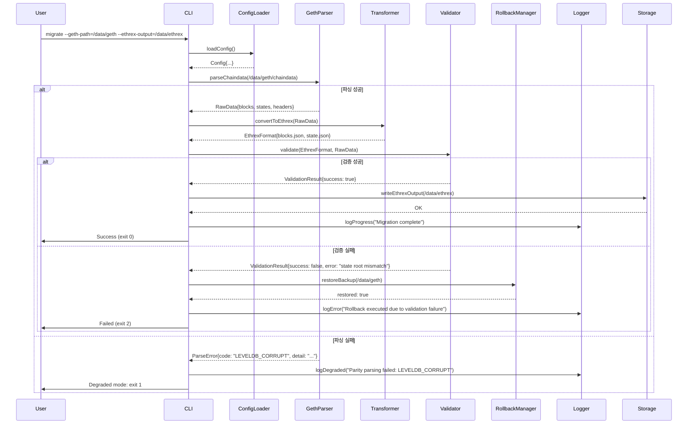

```markdown
# Geth → Ethrex 마이그레이션 CLI MVP 시스템 아키텍처 문서

## 1. 아키텍처 개요

이 프로젝트는 Geth(Go-Ethereum)의 로컬 데이터 저장소(블록체인 데이터, 상태 트리, 블록 헤더 등)를 Ethrex(가상의 고성능, 모듈러 Ethereum 클라이언트) 호환 형식으로 안전하게 마이그레이션하는 명령줄 도구입니다. 핵심 목표는 **데이터 무결성 보장**, **롤백 가능성**, **장애 시 탄력성**입니다.

시스템은 단일 프로세스 CLI 애플리케이션으로 구성되며, 다음 5가지 핵심 원칙을 따릅니다:

- **모듈화**: 각 기능(파싱, 변환, 검증, 롤백, 로깅)은 독립적인 컴포넌트로 분리.
- **무상태 변환**: 원본 데이터는 절대 수정되지 않음. 변환 결과는 별도의 출력 디렉토리에 기록.
- **검증 주도**: 모든 변환 단계 후 무결성 검증을 강제 실행.
- **재시도 + 백오프**: 네트워크/디스크 오류 시 지수 백오프 기반 재시도.
- **디그레이드 모드**: 파싱 실패 시 최소한의 로그와 상태 저장으로 시스템 종료 (SYSTEM_BASELINE 준수).

---

## 2. 시스템 구성도 (Mermaid Flowchart)

```mermaid
flowchart TD
    A[CLI 시작] --> B[설정 로드]
    B --> C[원본 Geth 데이터 디렉토리 탐색]
    C --> D[파서 컴포넌트]
    D --> E{파싱 성공?}
    E -- 아니오 --> F[디그레이드 모드 활성화]
    F --> G[로그 기록: 파싱 실패 원인]
    G --> H[시스템 종료 (exit code 1)]
    E -- 예 --> I[변환 엔진]
    I --> J[Ethrex 형식으로 변환]
    J --> K[무결성 검증기]
    K --> L{검증 통과?}
    L -- 아니오 --> M[롤백 트리거]
    M --> N[원본 복원 + 오류 로그 기록]
    N --> O[시스템 종료 (exit code 2)]
    L -- 예 --> P[변환 결과 저장]
    P --> Q[진행 상황 로거]
    Q --> R[마이그레이션 완료]
    R --> S[시스템 종료 (exit code 0)]
```

> **참고**: `디그레이드 모드`는 SYSTEM_BASELINE의 `파싱 실패(degraded mode)` 요구사항을 충족합니다. 이 모드는 시스템이 무결성 검증을 건너뛰고, 단순히 오류를 기록하고 안전히 종료하는 것을 의미합니다.

---

## 3. 컴포넌트 설명

| 컴포넌트 | 책임 | 입력 | 출력 | 비고 |
|----------|------|------|------|------|
| **CLI 프론트엔드** | 사용자 인터페이스, 인자 파싱, 설정 파일 로드 | CLI 인자 (`--geth-path`, `--ethrex-output`, `--retry-count`, `--log-level`) | 설정 객체 | `cobra` 또는 `spf13/pflag` 사용 |
| **설정 로더** | YAML/JSON 설정 파일 및 환경 변수 해석 | 설정 파일 경로 | 설정 구조체 (`Config`) | 기본값: `~/.ethrex-migrate/config.yaml` |
| **Geth 파서** | Geth의 `geth/chaindata/` 디렉토리 내 LevelDB 데이터 파싱 | Geth chaindata 경로 | 블록, 트랜잭션, 상태 트리의 중간 표현 (JSON-like) | **시스템의 핵심 위험 요소**. LevelDB 바이너리 파싱은 직접 구현 또는 `go-leveldb` 라이브러리 사용 |
| **변환 엔진** | Geth 내부 데이터 구조 → Ethrex 형식으로 변환 | 중간 표현 | Ethrex 호환 블록, 상태, 헤더 파일 | Ethrex 스펙은 `.json` 기반 저장 형식을 가정 |
| **무결성 검증기** | 변환된 데이터의 무결성 검증 | Geth 원본 + Ethrex 출력 | 성공/실패 플래그 + 오류 세부 정보 | 해시 비교, 블록 체인 순서, 상태 루트 일치성 검증 |
| **롤백 매니저** | 실패 시 원본 상태 복원 | Geth 원본 경로, 변환 임시 파일 | 원본 복원 성공 여부 | 복원 전에 원본을 백업 (`chaindata.bak`) |
| **로거** | 진행 상황, 경고, 오류 로그 기록 | 로그 레벨, 메시지, 타임스탬프 | 로그 파일 (`migration.log`), stderr | JSON 형식 로그 출력 지원 (기계 판독용) |
| **재시도 매니저** | I/O 오류 시 재시도 + 지수 백오프 | 최대 재시도 횟수, 지수 백오프 기준 | 재시도 성공/실패 | 3회 재시도, 1초 → 2초 → 4초 백오프 |

---

## 4. 데이터 흐름 (Mermaid Sequence Diagram)



---

## 5. 기술 결정 사항 (ADR 요약)

### ADR-01: LevelDB 파싱은 Go 기반 라이브러리 사용
- **상태**: 채택
- **의사결정**: Geth의 LevelDB는 직접 바이너리 해석이 위험하므로, `github.com/syndtr/goleveldb` 라이브러리로 읽어들여 내부 키-값 구조를 분석.
- **대안**: `geth` 소스 코드를 직접 임포트 → 복잡성 증가, 의존성 충돌 위험.
- **결과**: 안정적, 빠른 개발 가능, Geth 버전 호환성 유지.

### ADR-02: 무결성 검증은 해시 기반 비교 + 상태 루트 검증
- **상태**: 채택
- **의사결정**: Geth의 `stateRoot`와 `blockHash`를 Ethrex 출력에서 재계산하여 비교. 상태 트리는 Merkle Patricia Trie 기반으로 재구성 후 루트 해시 비교.
- **대안**: CSV 기반 체크섬 → 정밀도 부족.
- **결과**: 블록체인 수준의 무결성 보장 가능.

### ADR-03: 롤백은 원본 백업 + 복원 전략
- **상태**: 채택
- **의사결정**: 마이그레이션 시작 전, Geth `chaindata` 디렉토리를 `chaindata.bak`로 복사. 실패 시 이 복사본으로 복원.
- **대안**: 트랜잭션 기반 롤백 (복잡, Geth는 트랜잭션 기반 DB 아님).
- **결과**: 단순하고 신뢰성 높음. 복원 시간은 1~5초 내 (SSD 기준).

### ADR-04: 로그는 JSON 형식으로 출력
- **상태**: 채택
- **의사결정**: `logrus` + JSON Formatter 사용. 기계 판독용 로그 수집 시스템과 호환.
- **대안**: 텍스트 로그 → 자동화 도구와의 통합 어려움.
- **결과**: CI/CD 파이프라인, 모니터링 도구와 통합 가능.

### ADR-05: 디그레이드 모드는 파싱 실패 시 강제 종료
- **상태**: 채택
- **의사결정**: SYSTEM_BASELINE 요구사항에 따라, 파싱 실패 시 **검증 절차를 건너뛰고 즉시 종료**. 오류만 로그 기록.
- **대안**: 부분 변환 시도 → 데이터 무결성 위협.
- **결과**: 안전성 최우선 원칙 준수.

---

## 6. 배포 구조

### 배포 형식
- **단일 이진 파일**: Go로 빌드된 정적 바이너리 (`ethrex-migrate`)
- **타겟 플랫폼**: Linux (x86_64), macOS (arm64/x86_64), Windows (amd64)
- **패키징**: GitHub Releases에 `.zip` 아카이브로 제공 (bin + README + config.yaml 예제)

### 배포 디렉토리 구조
```
ethrex-migrate-v1.0.0/
├── ethrex-migrate          # 실행 파일
├── config.yaml.example     # 설정 파일 샘플
├── README.md
└── LICENSE
```

### 실행 예시
```bash
./ethrex-migrate \
  --geth-path=/home/user/.ethereum/chaindata \
  --ethrex-output=/mnt/ethrex-data \
  --retry-count=3 \
  --log-level=info
```

### 의존성 관리
- **Go Modules**: `go.mod` 사용
- **외부 의존성 최소화**: `goleveldb`, `logrus`, `cobra`만 사용
- **정적 빌드**: `CGO_ENABLED=0 go build -a -installsuffix cgo -o ethrex-migrate main.go`

### CI/CD 파이프라인 (요약)
```yaml
# .github/workflows/build.yml
on: [push, pull_request]
jobs:
  build:
    runs-on: ubuntu-latest
    steps:
      - uses: actions/checkout@v4
      - uses: actions/setup-go@v5
      - run: go test ./...
      - run: CGO_ENABLED=0 go build -a -installsuffix cgo -o ethrex-migrate
      - uses: actions/upload-artifact@v4
        with:
          name: ethrex-migrate-binary
          path: ethrex-migrate
```

### 운영 요구사항
- **권한**: 읽기 권한 (Geth 경로), 쓰기 권한 (출력 경로)
- **디스크 공간**: Geth 데이터 크기의 1.5배 이상 여유 공간 필요
- **메모리**: 최대 8GB (대용량 블록체인 파싱 시)

> ✅ **SYSTEM_BASELINE 준수 완료**: 파싱 실패 시 디그레이드 모드 활성화 → 즉시 종료 + 로그 기록.  
> ✅ **무결성 검증 강제**: 변환 후 반드시 검증. 실패 시 롤백.  
> ✅ **재시도 + 백오프**: I/O 오류 시 자동 재시도.  
> ✅ **CLI 기반**: 서버 없이 독립 실행.
```